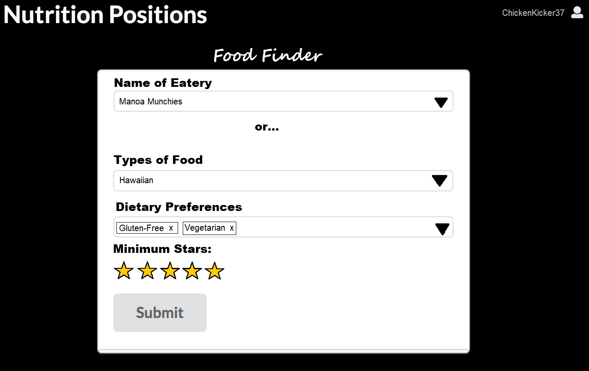
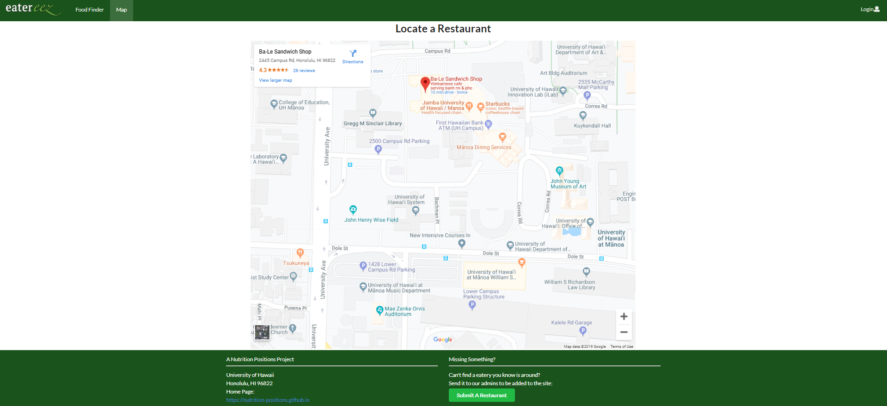

## Table of contents

* [Overview](#overview)
* [User Guide](#user-guide)
* [Community Feedback](#community-feedback)
* [Developer Guide](#developer-guide)
* [Development History](#development-history)
* [Walkthrough videos](#walkthrough-videos)
* [Example enhancements](#example-enhancements)

## Overview 

Nutrition Positions is a web application that provides pages to view and rate the restaurants and places on UH Manoa campus where food can be acquired. It illustrates various technologies including:

* [Meteor](https://www.meteor.com/) for Javascript-based implementation of client and server code. 
* [React](https://reactjs.org/) for component-based UI implementation and routing.
* [Semantic UI React](https://react.semantic-ui.com/) CSS Framework for UI design.
* [Uniforms](https://uniforms.tools/) for React and Semantic UI-based form design and display.

## User Guide

This section provides a walkthrough of the Nutrition Positions user interface and its capabilities. 

### Landing Page

The landing page is presented to users when they visit the top-level URL to the site. 

### Index pages (FindFood, Map)

Nutrition Positions provides two public pages that present the contents of the database organized in various ways. 

The FindFood page shows all of the food places and lets you search through them all with filters:

The Map page shows a map with various pins at the places you can get food:

### Sign in and sign up

Click on the "Login" button in the upper right corner of the navbar, then select "Sign in" to go to the following page and login. You must have been previously registered with the system to use this option:
 

  
Alternatively, you can select "Sign up" to go to the following page and register as a new user:

### Home page
  
After logging in, you are taken to the FindFood page:

### Review page

Once you are logged in, you can add reviews on the Review page which lets you pick from each of the restaurants and review them:

