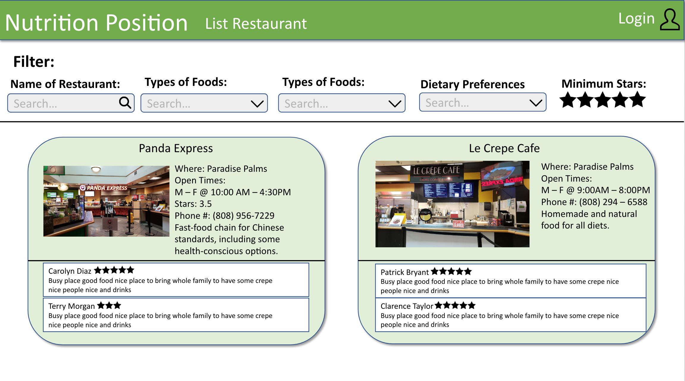
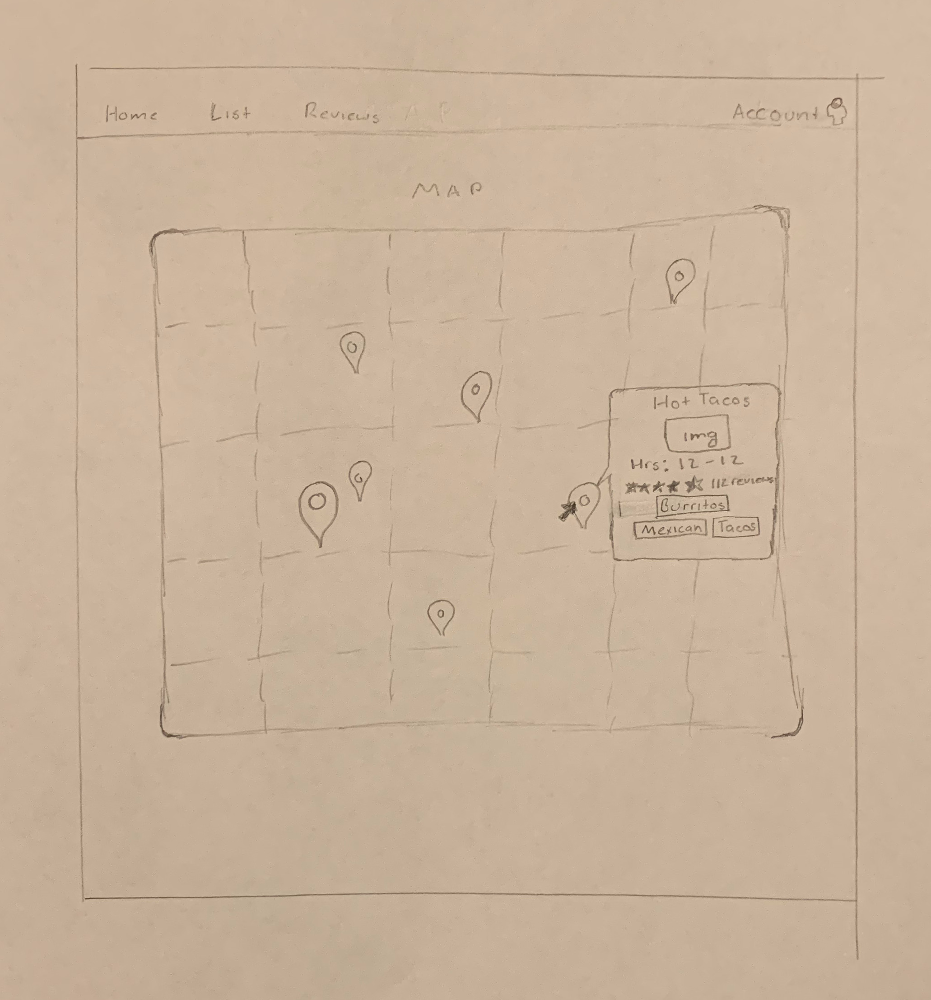
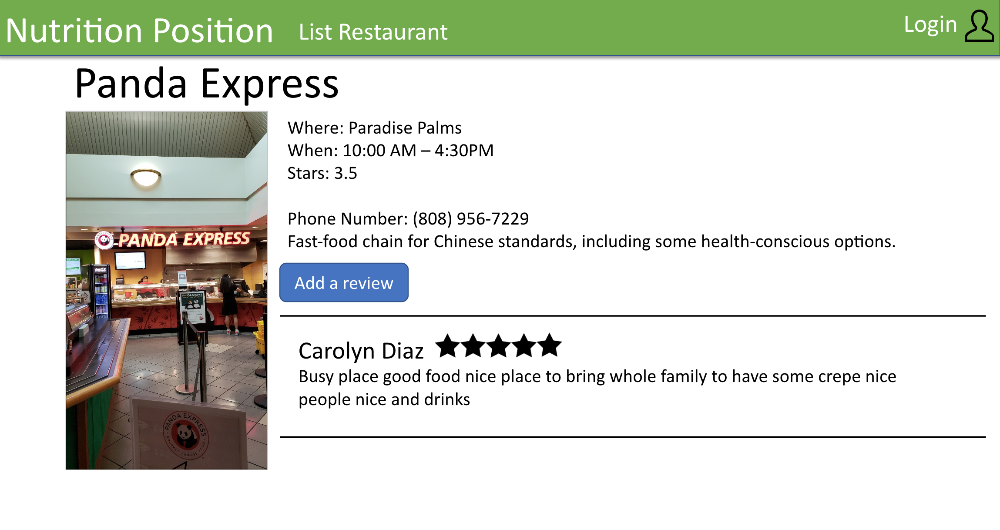
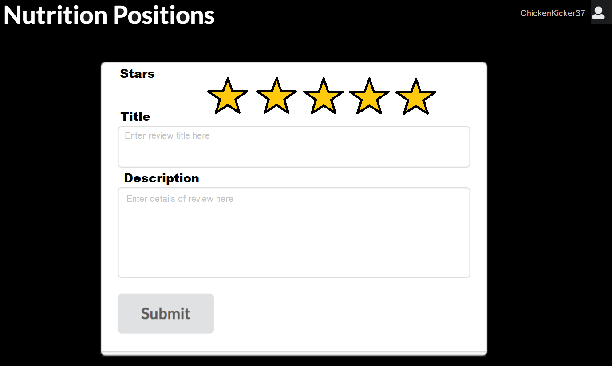

## Overview 

Nutrition Positions is a web application that provides pages to locate, rate, and view the menus of the restaurants and food places on UH Manoa campus. It will illustrate various technologies including:

* [Meteor](https://www.meteor.com/) for Javascript-based implementation of client and server code. 
* [React](https://reactjs.org/) for component-based UI implementation and routing.
* [Semantic UI React](https://react.semantic-ui.com/) CSS Framework for UI design.
* [Uniforms](https://uniforms.tools/) for React and Semantic UI-based form design and display.

### Group Members

Ryan Ell
- Student working on a B.S. in Math with Data Science 
- Hoping to contribute to the design/layout of the project as well as help manage the team members and learn more about software development
- Has skills in Photoshop, layout and design and software development from taking ICS 314 in college
- Further details about my escapades can be found [here](https://ryanell.github.io)

Tommy Herman
- Studying Computer Science to earn a B.S.
- Experienced in operating and repairing air separation units and nuclear reactors, now looking to gain knowledge and experience in software development projects
- Seeking to apply computer skills to tackle a larger programming project coordinating with a team
- Learned in HTML, Java, C++, Javascript, and BASIC languages
- Further details about  can be found [here](https://hermantw.github.io)

Colin Jackson
- Student working on a B.S. in Computer Science w/ focus in Security Science
- Hoping to gain a deeper understanding of how websites handle data base queries and potentially tackle a screen scraping script
- Have skills in Linux, Cryptography, Networks, and password cracking
- More info on my latest project can be found on my [portfolio](https://colinj23.github.io)

James Lau
- Junior majoring in BS in Computer Science with a focus in Cyber Sercuity.
- Interested in both software engineering and cyber security.
- Java is my favorite programming language.
- More info at https://jklaulau.github.io/

### Current Progress

The project is currently in the stage of cementing the look of the web application, as well as creating the components and layouts of each of the planned pages. The app will keep track of the restaurants by using collections including but not limited to Restaurants and Reviews.

[Milestone 1](https://github.com/nutrition-positions/eatereez/projects/1) shows the current status of the project as it heads towards the first milestone, which is a mockup of each of the project pages.

## Project Pages

This section provides a walkthrough of the Nutrition Positions user interface and its capabilities. 

### Landing Page

The landing page is presented to users when they visit the top-level URL to the site. It will have a description of the purpose and features of Nutrition Positions.

### Index pages (FindFood, Map, Restaurant page)

Nutrition Positions provides three public pages that present the contents of the database organized in various ways. 

The FindFood page displays a list of restaurants, with the ability to be filtered by food type (Mexican, Thai, Hawaiian, etc...), whether they are currently open, and ratings. Each restaurant will also have the most upvoted user reviews, and an average rating which will allow the list to be sorted based on those ratings:

The Map page shows a map with various pins at the places you can get food:

The Restaurant page will show even more details about each restaurant, such as their menu and the full list of reviews:

### Sign in and sign up

Click on the "Login" button in the upper right corner of the navbar, then select "Sign in" to go to the following page and login. You must have been previously registered with the system to use this option:
 

  
Alternatively, you can select "Sign up" to go to the following page and register as a new user:

### Review page

Once you are logged in, you can add reviews on the Review page which lets you pick from each of the restaurants and review them:

### Submit Eatery

Logged in users will also be able to submit new restaurants to the website, which will then be subject to approval by site admins before being published.

