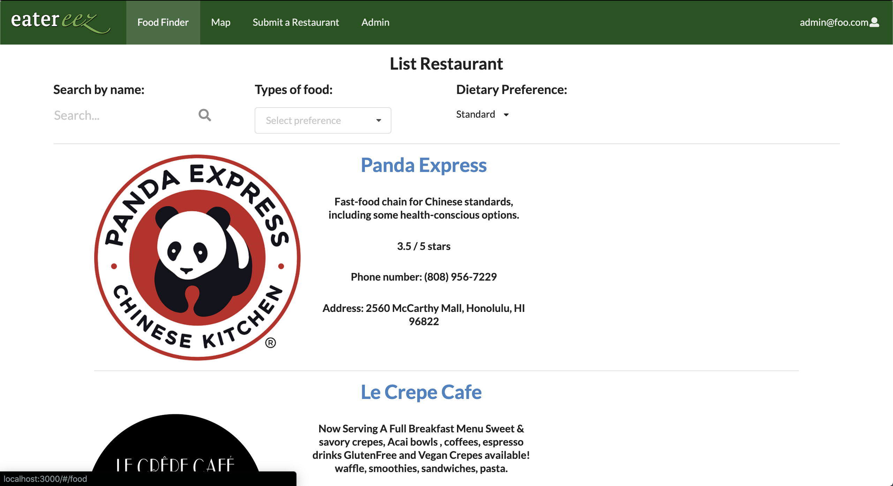
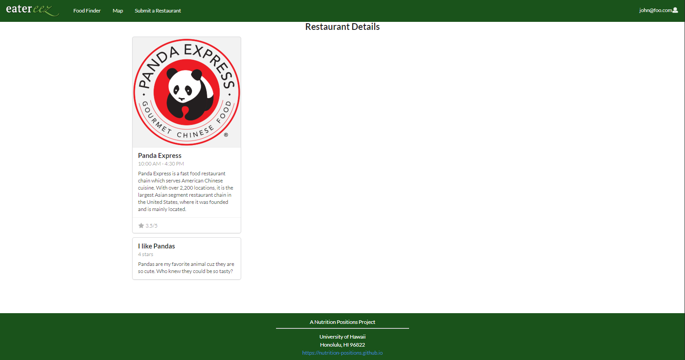

## Overview 

Eatereez is a web application that provides pages to locate, rate, and view the menus of the restaurants and other food places on the UH Manoa campus. In addition, it will allow users to search for restaurants based on both meal preferences (e.g. burrito) and dietary restrictions (e.g. vegetarian, gluten-free, etc.).  It illustrates various technologies including:

* [Meteor](https://www.meteor.com/) for Javascript-based implementation of client and server code. 
* [React](https://reactjs.org/) for component-based UI implementation and routing.
* [Semantic UI React](https://react.semantic-ui.com/) CSS Framework for UI design.
* [Uniforms](https://uniforms.tools/) for React and Semantic UI-based form design and display.

The web application is displayed here:
[Eatereez](http://eatereez.meteorapp.com/#/)

### Current Progress

The project is currently in the stage of cementing the look of the web application, as well as creating the components and layouts of each of the planned pages. The app will keep track of the restaurants by using collections including but not limited to Restaurants and Reviews.

[Milestone 1](https://github.com/nutrition-positions/eatereez/projects/1) shows the current status of the project at the completion of the first milestone, which includes mockups of each of the project pages.

[Milestone 2](https://github.com/nutrition-positions/eatereez/projects/2) shows the current status of the project as it heads towards the second milestone, which involves creating functional webpages for the website.

## Project Pages

This section provides a walkthrough of the Eatereez user interface and its capabilities. 

### Landing Page

The [landing page](http://eatereez.meteorapp.com/#/) is presented to users when they visit the top-level URL to the site. It will have a description of the purpose and features of Eatereez.

### Index pages (FindFood, Map, Restaurant pages)

Eatereez provides three public pages that present the contents of the database organized in various ways. 

The [FindFood](http://eatereez.meteorapp.com/#/food) page displays a list of restaurants, with the ability to be filtered by food type (Mexican, Thai, Hawaiian, etc...), whether they are currently open, and ratings. Each restaurant will also have the most liked user reviews, and an average rating which can be applied towards sorting restaurants by those ratings:

The [Map](http://eatereez.meteorapp.com/#/map) page shows a map with various pins at the places you can get food:

The [Restaurant](http://eatereez.meteorapp.com/#/restaurant) page will show even more details about each restaurant, such as their menu and the full list of reviews:

### Sign in and sign up

Click on the ["Login"](http://eatereez.meteorapp.com/#/signin) button in the upper right corner of the navbar, then select "Sign in" to go to the following page and login. You must have been previously registered with the system to use this option:
 

  
Alternatively, you can select ["Sign up"](http://eatereez.meteorapp.com/#/signup) to go to the following page and register as a new user:

### Review page

Once you are logged in, you can add reviews on the [Review](http://eatereez.meteorapp.com/#/review) page which lets you pick from each of the restaurants and review them:

### Submit Eatery

Logged in users will also be able to [submit new restaurants](http://eatereez.meteorapp.com/#/submit-restaurant) to the website, which will then be subject to approval by site admins before being published.

### Group Members
[Ryan Ell](https://ryanell.github.io)

[Tommy Herman](https://hermantw.github.io)

[Colin Jackson](https://colinj23.github.io)

[James Lau](https://jklaulau.github.io)

