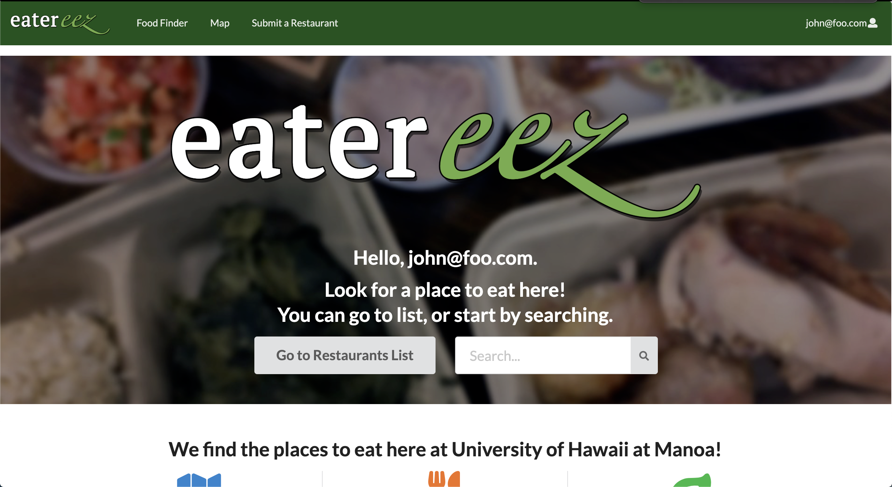
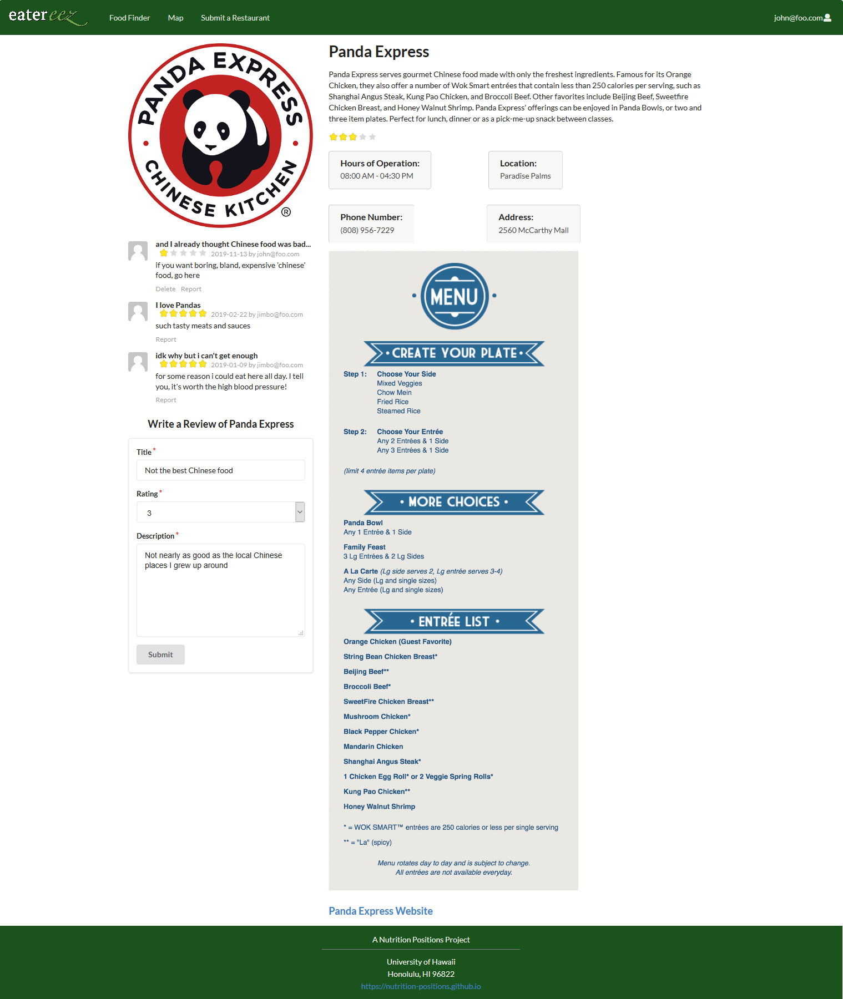

## Overview 

Eatereez is a web application that provides pages to locate, rate, and view the menus of the restaurants and other food places on the UH Manoa campus. In addition, it will allow users to search for restaurants based on both meal preferences (e.g. burrito) and dietary restrictions (e.g. vegetarian, gluten-free, etc.).  It illustrates various technologies including:

* [Meteor](https://www.meteor.com/) for Javascript-based implementation of client and server code. 
* [React](https://reactjs.org/) for component-based UI implementation and routing.
* [Semantic UI React](https://react.semantic-ui.com/) CSS Framework for UI design.
* [Uniforms](https://uniforms.tools/) for React and Semantic UI-based form design and display.

The web application is displayed here:
[Eatereez](http://eatereez.meteorapp.com/#/)

### Project Milestones

Eatereez has completed each of its milestones by the launch deadline, which are listed below
 
[Milestone 1](https://github.com/nutrition-positions/eatereez/projects/1) shows tasks finished for the project at the
 completion of the
 first milestone, which includes mockups of each of the project pages.

[Milestone 2](https://github.com/nutrition-positions/eatereez/projects/2) shows tasks that were finished for the
 second milestone of the project, which involves creating functional webpages for the website.

[Milestone 3](https://github.com/nutrition-positions/eatereez/projects/3) shows the tasks completed in the last milestone. This milestone's goal was to give the application an aesthetic touch which includes an overhaul of the landing page, restaurant page, and other small things. Included in our goals is to complete the implementation of the restaurant reviews and map. After some user reviews, a lot of functionality was added for the admin to be able to better control the website.

### User Guide

#### Landing Page

The [landing page](http://eatereez.meteorapp.com/#/) is presented to users when they visit the top-level URL to the site. It has a description of the purpose and features of Eatereez. The landing page contains four sections. 

The first section provides the user with a button and a search bar so they can get straight into searching. This section will also greet the user if they are logged in.

Second section contains information about the site. All icons and text here are clickable and will redirect the user to the relevant page. 

Third section has a picture carousel with three random eateries included in the application. This section is to help
 alleviate
 deciding
 where to eat
 should the user been unable to decide. 

The fourth section is a reminder to login so that the user can take advantage of all functionalities such as making comments or reporting comments.

####Find Food

The [Find Food](http://eatereez.meteorapp.com/#/food) page displays a list of restaurants, with the ability to be filtered by food type (Hawaiian, Chinese, Sandwiches, etc...), location, and dietary preference (Vegan, vegetarian). Each restaurant will also have an average rating displayed:

#### Map

The [Map](http://eatereez.meteorapp.com/#/map) page shows a map with various pins at the places you can get food. By clicking the pins, you can see what restaurants there and a link to more information.

The [Restaurant Details](http://eatereez.meteorapp.com/#/details/cd8Yp98TZpR4fnpqT) pages shows even more details about each restaurant, such as their menu, full description and the full list of reviews:

#### Sign in and sign up

Click on the ["Sign up"](http://eatereez.meteorapp.com/#/signup) to go to the following page and register as a new
 user.  You must have been previously registered with the system to use this option:
 

  
Alternatively, you can select ["Sign In"](http://eatereez.meteorapp.com/#/signin) button in the upper right corner of
 the navbar to go to the following page and login.

#### Leave Reviews

Once you are logged in, you can add reviews on the [Restaurant Details](http://eatereez.meteorapp.com/#/) page of
 each restaurant, as well as report the reviews of other users by clicking on "Report" below the other users' review.

#### Submit Eatery

Logged in users will also be able to [submit new restaurants](http://eatereez.meteorapp.com/#/submit-restaurant) to the website, which will then be subject to approval by site admins before being published.

#### Admin

Admin users have the ability to read all of the submitted restaurants, reports and reported reviews on the Admin page
. There they can delete reported reviews or unreport the reivews as well as add the submitted restaurants to the
 restaurant database after careful consideration.
 
 
 
 Admin users can also edit the restaurant pages as well as delete restaurants from the database with the extra admin
  options box that shows up on the restaurant details page.
 
 

### Community Feedback

Jaylin Kuoha (Food loving Mathematics Major)
- Could use something extra to fill in the white space
- I like that there's a menu for each of the restaurants listed
- The colors are nice on the eyes

Matthew Mackenzie (At the time starving Geology Major)
- It's pretty impressive, but I don't like the green bar at the bottom having a bunch of white below it
- The logo is pretty gnar

Somebody
The homepage looks neat and clean, love the logo on the background.  However, the logo, search bar, and button seem off center. I really like the way the map looks but the links are broken and the “How To” section feels a little out of place.  I like having both the location and address listed.  I’d like that if i clicked on the menu or website link it would open in a new tab.   Loving the reviews! Wish I could sort by them.  Also I like the submit a restaurant page because there are so many sites that miss info and to be able to submit new info makes me feel good and not annoyed it’s missing something.

Jake Camarao (CS major)
- Likes the convenient search bar on the landing page
- Wants to sort the restaurants by stars

### Group Members
[Ryan Ell](https://ryanell.github.io)

[Tommy Herman](https://hermantw.github.io)

[Colin Jackson](https://colinj23.github.io)

[James Lau](https://jklaulau.github.io)

